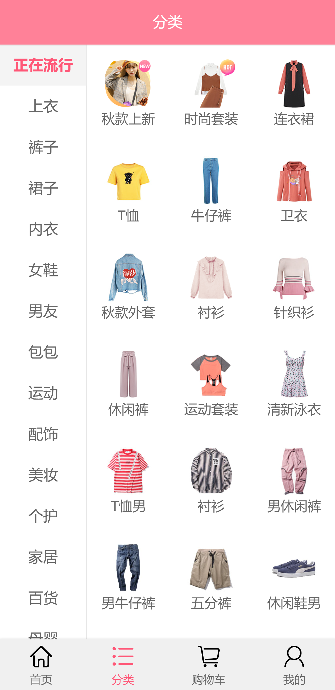

# mall-mogujie

## 项目说明

[详细说明文档](./%E9%A1%B9%E7%9B%AE%E8%AF%B4%E6%98%8E.md)

演示地址：https://xu-ux.github.io/mall-mogujie/

## 技术栈

- vue2
- vue-router3
- vuex3
- axios
- vue-scroller
- better-scroll
- vue-awesome-swiper
- scss
- vue-lazyload
- vue-cli3


## 启动

克隆项目(dev分支即可)

```
git clone --depth 1 -b dev https://github.com/xu-ux/mall-mogujie.git
```

安装

```
npm install
```

开发环境，预览

```shell
npm run dev
```

打包，部署生产

```shell
npm run build:prod
```

❗ test环境使用的是mock数据 `npm run test`


## 截图

首页


详情


分类



购物车


